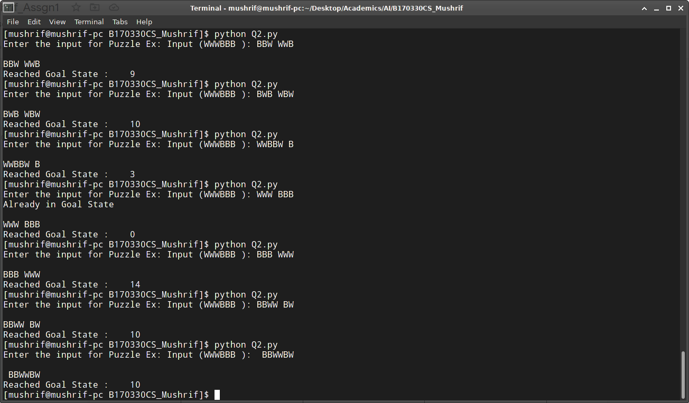
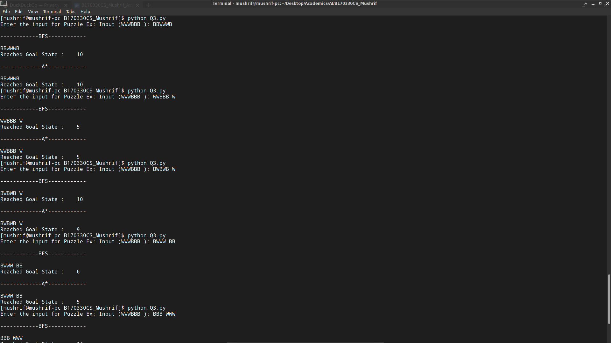
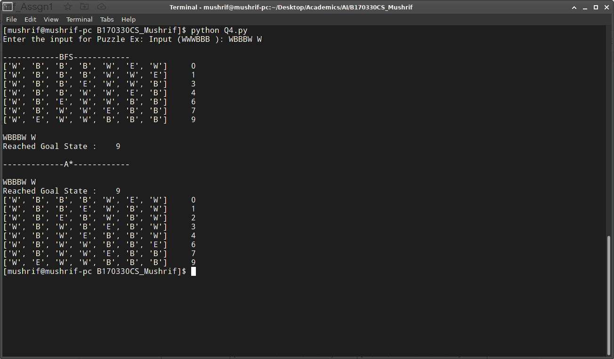
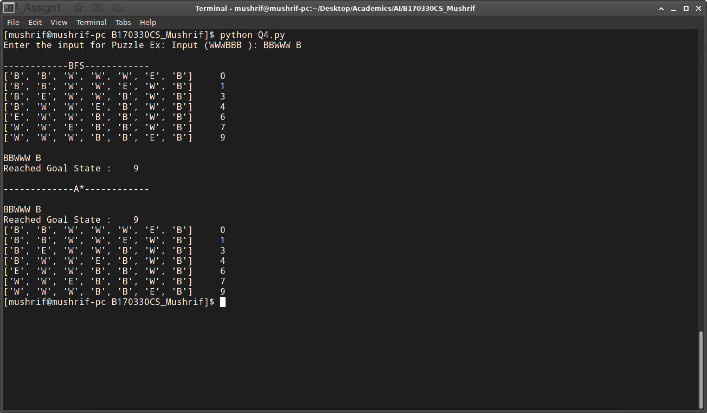
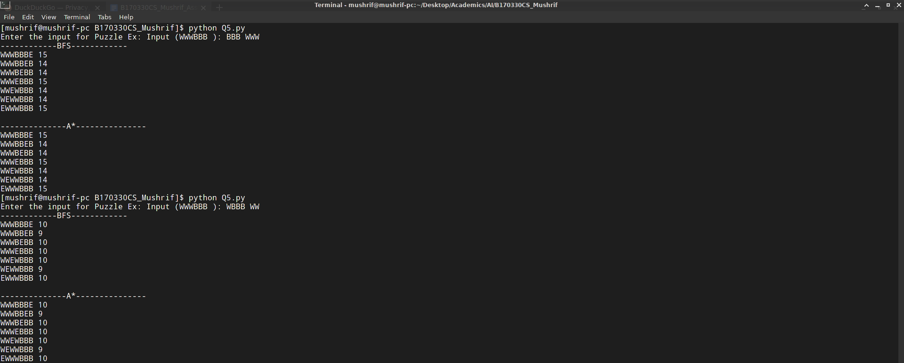
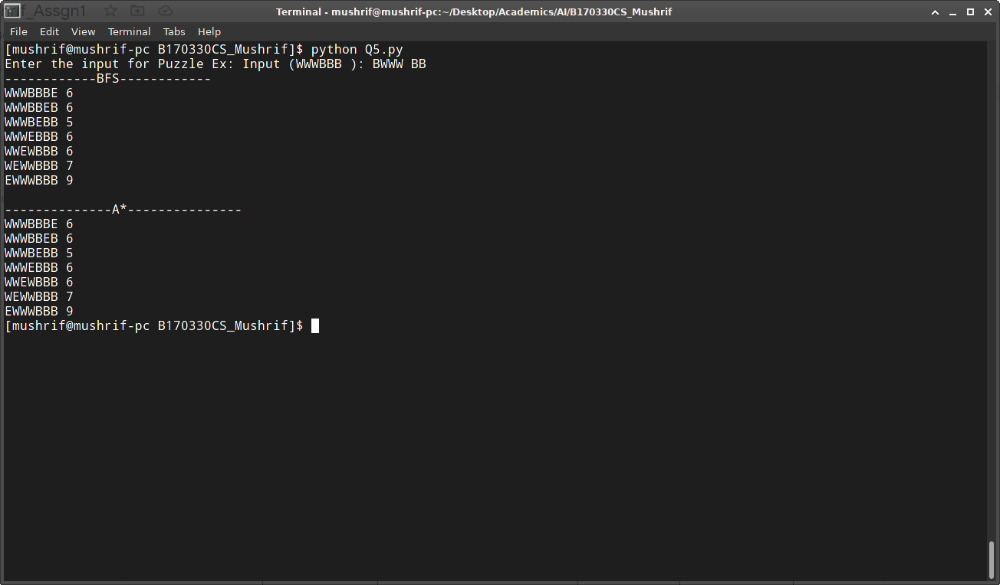

Mushrif, B170330CS

For each problem separate python program has been made.

Screenshots are also attached in the "Screenshot" Folder.

For executing the python program:

    1.  For first question:     python3 Q1.py
</img>

    2.  For second question:    python3 Q2.py
</img>

    3.  For third question:     python3 Q3.py
</img>

    4.  For fourth question:    python3 Q4.py
</img>
</img>
</img>
</img>

    5.  For fifth question:     python3 Q5.py
</img>
</img>
